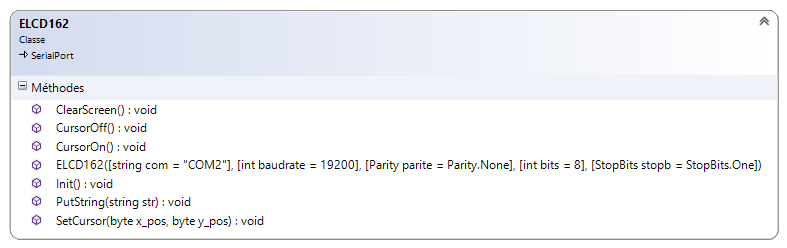
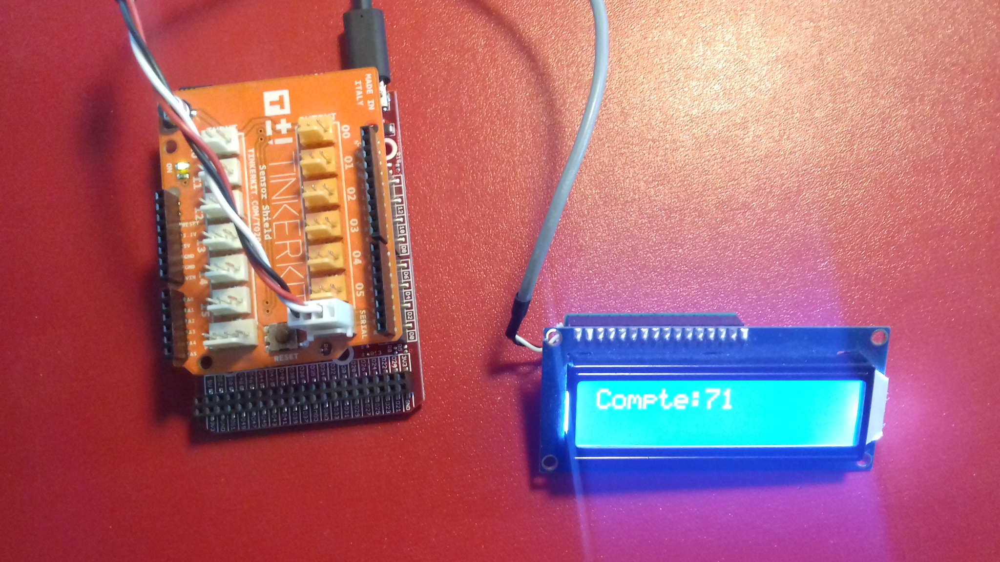

# ELCD162

**Description**
----
Source code.

A **.NETMF v4.3 class** write for ELCD162 module.

This class is also in the [MicroToolsKit](https://www.nuget.org/packages/WEBGE.Microtoolskit/) **library**. Download at [nuget.org](https://www.nuget.org).

 
 
**Hardware**
----
**Targets**: Netduino, Netduino2 plus, Netduino 3, FEZ PANDA 3 et COBRA 3.

**Software**
----
* **Language** : C#
* **Framework used** : .NETMF 4.3
* **IDE** : Visual Studio Community 2015
* **xml** : documentation inside class  

**Visual Studio solution**
----
* **ELCD162**
  * **ELCD162** : .NetMF class

* **Netduino** : class test program for Netduino board
* **FezPanda** : class test program for Fez Panda board

**Assembly**
----

**Videos to see on youtube**
----
None

**Keywords**
----
RS232, COMFILE Module, LCD, Netduino, FEZ, PANDA, COBRA, C#, NETMF, Visual Studio.

**Tested on**
----
Fez Panda III, Netduino2 plus

**Todo list**
----
Custom characters

**To get started**
----
* [ELCD162 GitHub Page](http://webge.github.io/ELCD162/) (French).

**Feed on Google+**
----
* [C# embarqué et .NetMF v4.3 : Netduino et GHI FEZ](https://plus.google.com/collection/oaaJX) (French).

**Wiki**
----
* [C# embarqué et .NetMF v4.3 pour les cartes Netduino et GHI FEZ](http://webge.dyndns-server.com/dokuwiki/doku.php?id=netmf43:accueilnetmf) (French).

**Project site**
----
* [MicroToolsKit library](http://webge.dyndns-server.com/dokuwiki/doku.php?id=netmf43:6_microtoolskit) (English).
#
**Maintened by** [WebGe](mailto:philippemariano@gmail.com)
